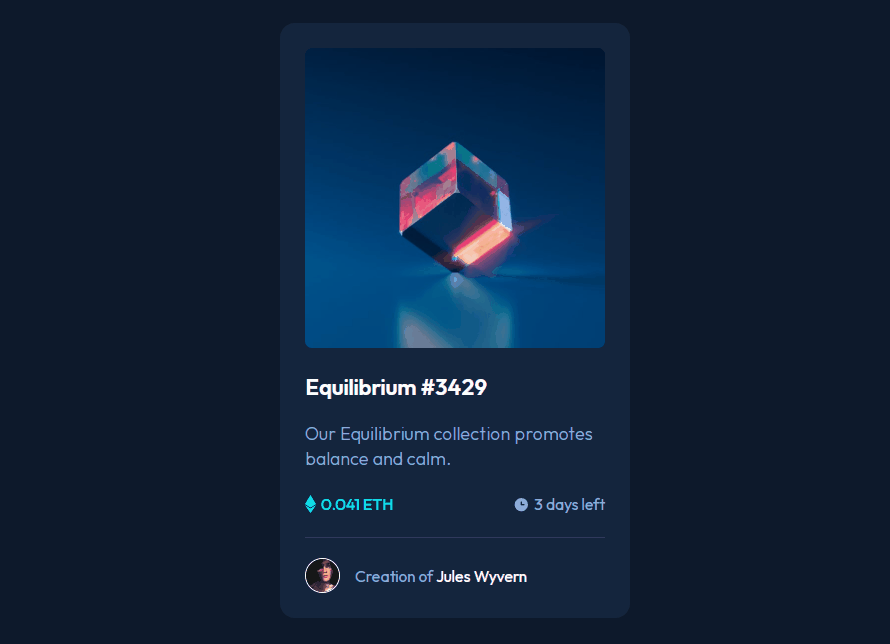

# NFT preview card component 

Solução do projeto do Frontend Mentor. Durante o desenvolvimento deste projeto foi possível colocar em prática conceitos de HTML e CSS. 

[]

## Meu processo

### Tecnologias utilizadas

- HTML
- CSS

### O que aprendi

Adquiri mais conhecimento na importância de utilizar o display flex para a criação do layout. 
Inserindo os ícones através do CSS com os pseudo-elementos. 
Fazendo uso de position absolute e position relative nos elementos juntamente com outras propriedades, como forma de aplicar cor e/ou ícone por cima dele, estilizando somente no momento em que o usuário passar com o mouse. 
